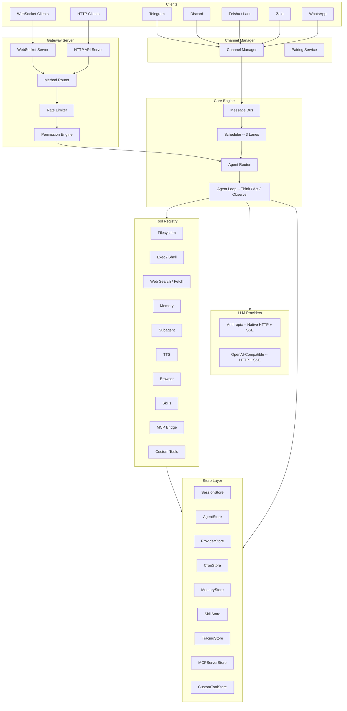
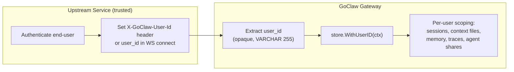
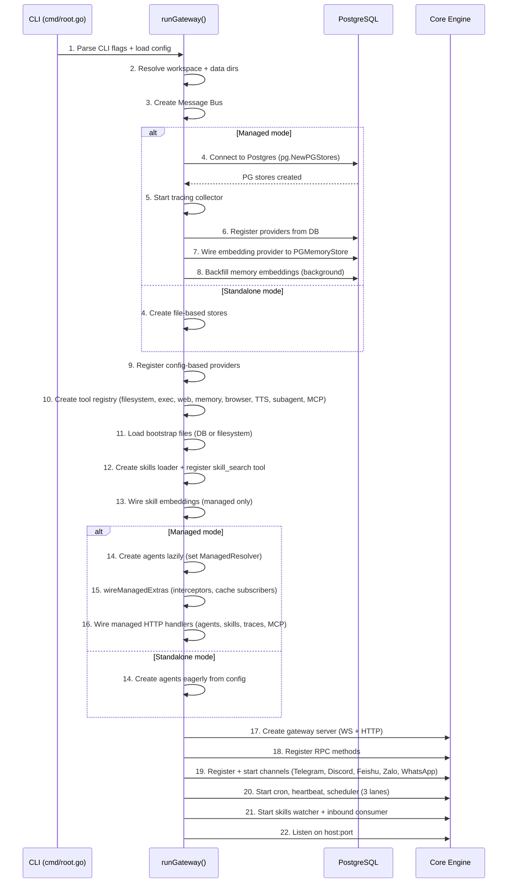
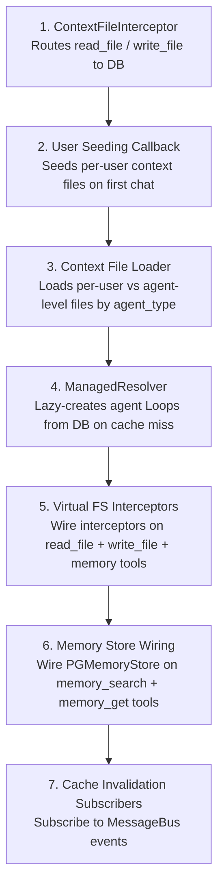
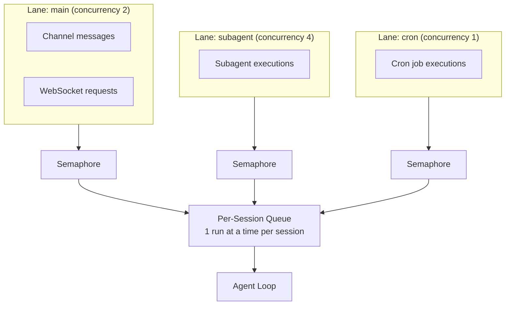
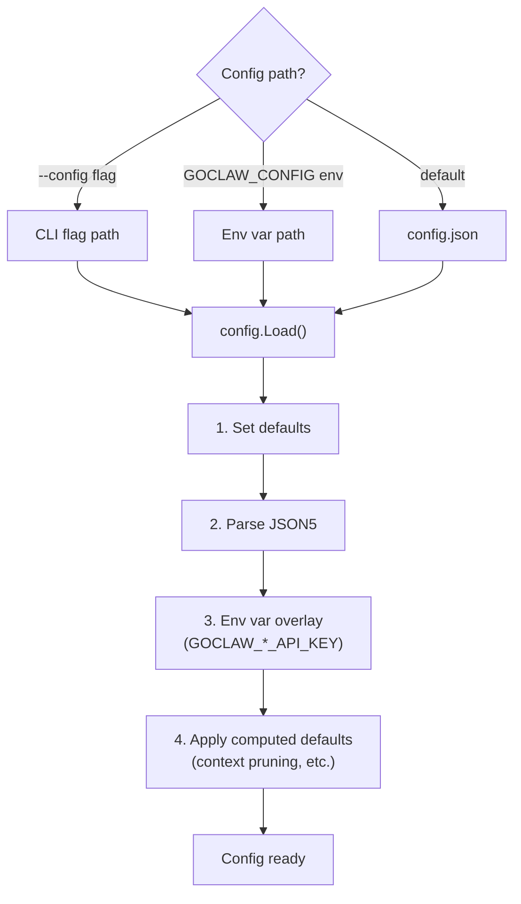

# 00 - Architecture Overview

## 1. Overview

GoClaw is an AI agent gateway written in Go. It exposes a WebSocket RPC (v3) interface and an OpenAI-compatible HTTP API for orchestrating LLM-powered agents. The system supports two operating modes:

- **Standalone** -- file-based storage, single-user, zero external dependencies beyond an LLM API key.
- **Managed** -- PostgreSQL-backed multi-tenant mode with HTTP CRUD APIs, per-user context files, encrypted credentials, and LLM call tracing.

> **Documentation scope**: This documentation is written for **managed mode** (PostgreSQL multi-tenant), which is the recommended production deployment. Standalone mode is functionally equivalent to the original OpenClaw -- all users share the same workspace, sessions, and context files with no per-user isolation, no encrypted secrets, no tracing, and no HTTP CRUD APIs. The remainder of this documentation assumes managed mode unless stated otherwise.

## 2. Component Diagram



## 3. Module Map

| Module | Description |
|--------|-------------|
| `internal/gateway/` | WebSocket + HTTP server, client handling, method router |
| `internal/gateway/methods/` | RPC method handlers: chat, agents, sessions, config, skills, cron, pairing, exec approval, usage, send |
| `internal/agent/` | Agent loop (think, act, observe), router, resolver, system prompt builder, sanitization, pruning, tracing, memory flush |
| `internal/providers/` | LLM providers: Anthropic (native HTTP + SSE streaming), OpenAI-compatible (HTTP + SSE), retry logic |
| `internal/tools/` | Tool registry, filesystem ops, exec/shell, policy engine, subagent, context file + memory interceptors, credential scrubbing, rate limiting |
| `internal/tools/dynamic_loader.go` | Custom tool loader: LoadGlobal (startup), LoadForAgent (per-agent clone), ReloadGlobal (cache invalidation) |
| `internal/tools/dynamic_tool.go` | Custom tool executor: command template rendering, shell escaping, encrypted env vars |
| `internal/store/` | Store interfaces: SessionStore, AgentStore, ProviderStore, SkillStore, MemoryStore, CronStore, PairingStore, TracingStore, MCPServerStore |
| `internal/store/pg/` | PostgreSQL implementations (`database/sql` + `pgx/v5`) |
| `internal/store/file/` | File-based implementations (standalone mode) |
| `internal/bootstrap/` | System prompt files (AGENTS.md, SOUL.md, TOOLS.md, IDENTITY.md, USER.md, HEARTBEAT.md, BOOTSTRAP.md) + seeding + truncation |
| `internal/config/` | Config loading (JSON5) + env var overlay |
| `internal/skills/` | SKILL.md loader (5-tier hierarchy: workspace → project → personal → global → builtin) + BM25 search + hot-reload via fsnotify |
| `internal/channels/` | Channel manager + adapters: Telegram, Feishu/Lark, Zalo, Discord, WhatsApp |
| `internal/mcp/` | MCP server bridge (stdio, SSE, streamable-HTTP transports) |
| `internal/scheduler/` | Lane-based concurrency control (main, subagent, cron lanes) with per-session serialization |
| `internal/memory/` | Memory system (SQLite FTS5 + embeddings for standalone mode) |
| `internal/permissions/` | RBAC policy engine (admin, operator, viewer roles) |
| `internal/pairing/` | DM/device pairing service (8-character codes) |
| `internal/sessions/` | File-based session manager (standalone mode) |
| `internal/bus/` | Event pub/sub (Message Bus) |
| `internal/sandbox/` | Docker-based code execution sandbox |
| `internal/tts/` | Text-to-Speech providers: OpenAI, ElevenLabs, Edge, MiniMax |
| `internal/http/` | HTTP API handlers: /v1/chat/completions, /v1/agents, /v1/skills, /v1/traces, /v1/mcp |
| `internal/crypto/` | AES-256-GCM encryption for API keys |
| `internal/tracing/` | LLM call tracing (traces + spans), in-memory buffer with periodic store flush |
| `internal/tracing/otelexport/` | Optional OpenTelemetry OTLP exporter (opt-in via build tags; adds gRPC + protobuf) |
| `internal/heartbeat/` | Periodic agent wake-up service |

---

## 4. Two Operating Modes

| Aspect | Standalone | Managed |
|--------|-----------|---------|
| Config source | `config.json` + env vars | `config.json` + `GOCLAW_POSTGRES_DSN` |
| Storage | JSON files on disk | PostgreSQL |
| Agents | Defined in `config.json` `agents.list`, created eagerly at startup | `agents` table, lazy-resolved via `ManagedResolver` |
| Context files | Workspace filesystem (SOUL.md, IDENTITY.md, etc.) | `agent_context_files` + `user_context_files` tables |
| Agent types | N/A | `open` (7 per-user files) / `predefined` (agent-level + USER.md per-user) |
| Skills | Filesystem only (workspace + global dirs) | PostgreSQL + filesystem + embedding search |
| Memory | SQLite FTS5 + embeddings | pgvector hybrid (full-text search + vector similarity) |
| Tracing | N/A | `traces` + `spans` tables + optional OTel OTLP export |
| MCP servers | `config.json` `tools.mcp_servers` | `mcp_servers` table + grants |
| API key storage | `.env.local` / env vars only | PostgreSQL (AES-256-GCM encrypted) |
| HTTP CRUD API | N/A | `/v1/agents`, `/v1/skills`, `/v1/traces`, `/v1/mcp` |
| Virtual FS | Direct disk I/O | `ContextFileInterceptor` routes read_file/write_file to database |
| Custom tools | N/A | `custom_tools` table + `DynamicToolLoader` |
| Managed-only stores (nil in standalone) | -- | AgentStore, ProviderStore, TracingStore, MCPServerStore, CustomToolStore |

---

## 5. Multi-Tenant Identity Model

GoClaw uses the **Identity Propagation** pattern (also known as **Trusted Subsystem**). It does not implement authentication or authorization — instead, it trusts the upstream service that authenticates with the gateway token to provide accurate user identity.



### Identity Flow

| Entry Point | How user_id is provided | Enforcement |
|-------------|------------------------|-------------|
| HTTP API | `X-GoClaw-User-Id` header | Required in managed mode |
| WebSocket | `user_id` field in `connect` handshake | Required in managed mode |
| Channels | Derived from platform sender ID (e.g., Telegram user ID) | Automatic |

### Compound User ID Convention

The `user_id` field is **opaque** to GoClaw — it does not interpret or validate the format. For multi-tenant deployments, the recommended convention is:

```
tenant.{tenantId}.user.{userId}
```

This hierarchical format ensures natural isolation between tenants. Since `user_id` is used as a scoping key across all per-user tables (`user_context_files`, `user_agent_profiles`, `user_agent_overrides`, `agent_shares`, `sessions`, `traces`), the compound format guarantees that users from different tenants cannot access each other's data.

### Where user_id is used

| Component | Usage |
|-----------|-------|
| Session keys | `agent:{agentId}:{channel}:direct:{peerId}` — peerId derived from user_id |
| Context files | `user_context_files` table scoped by `(agent_id, user_id)` |
| User profiles | `user_agent_profiles` table — first/last seen, workspace |
| User overrides | `user_agent_overrides` — per-user provider/model preferences |
| Agent shares | `agent_shares` table — user-level access control |
| Memory | Per-user memory entries via context propagation |
| Traces | `traces` table includes `user_id` for filtering |
| MCP grants | `mcp_user_grants` — per-user MCP server access |
| Skills grants | `skill_user_grants` — per-user skill access |

---

## 6. Gateway Startup Sequence



---

## 7. Managed Mode Wiring

The `wireManagedExtras()` function in `cmd/gateway_managed.go` performs 7 steps to wire multi-tenant components:



### Cache Invalidation Events

| Event | Subscriber | Action |
|-------|-----------|--------|
| `cache:bootstrap` | ContextFileInterceptor | `InvalidateAgent()` or `InvalidateAll()` |
| `cache:agent` | AgentRouter | `InvalidateAgent()` -- forces re-resolve from DB |
| `cache:skills` | SkillStore | `BumpVersion()` |
| `cache:cron` | CronStore | `InvalidateCache()` |
| `cache:custom_tools` | DynamicToolLoader | `ReloadGlobal()` + `AgentRouter.InvalidateAll()` |

---

## 8. Scheduler Lanes

The scheduler uses a lane-based concurrency model. Each lane is a named worker pool with a bounded semaphore. Per-session serialization ensures only one agent run executes at a time per session key.



### Queue Modes

| Mode | Behavior |
|------|----------|
| `queue` | FIFO -- new messages wait until the current run completes |
| `followup` | Merges incoming message into the pending queue as a follow-up |
| `interrupt` | Cancels the active run and replaces it with the new message |

Default queue config: capacity 10, drop policy `old` (drops oldest on overflow), debounce 800ms.

---

## 9. Graceful Shutdown

When the process receives SIGINT or SIGTERM:

1. Broadcast `shutdown` event to all connected WebSocket clients.
2. `channelMgr.StopAll()` -- stop all channel adapters.
3. `cronStore.Stop()` -- stop cron scheduler.
4. `heartbeatSvc.Stop()` -- stop heartbeat service.
5. `sandboxMgr.Stop()` + `ReleaseAll()` -- release Docker containers.
6. `cancel()` -- cancel root context, propagating to consumer + scheduler.
7. Deferred cleanup: flush tracing collector, close memory store, close browser manager, stop scheduler lanes.
8. HTTP server shutdown with a **5-second timeout** (`context.WithTimeout`).

---

## 10. Config System

Configuration is loaded from a JSON5 file with environment variable overlay. Secrets are never persisted to the config file.



### Key Config Sections

| Section | Purpose |
|---------|---------|
| `gateway` | host, port, token, allowed_origins, rate_limit_rpm, max_message_chars |
| `agents` | defaults (provider, model, context_window) + list (per-agent overrides) |
| `tools` | profile, allow/deny lists, exec_approval, web, browser, mcp_servers, rate_limit_per_hour |
| `channels` | Per-channel: enabled, token, dm_policy, group_policy, allow_from |
| `database` | mode (standalone/managed); postgres_dsn read only from env var |

### Secret Handling

- Secrets exist only in env vars or `.env.local` -- never in `config.json`.
- `GOCLAW_POSTGRES_DSN` is tagged `json:"-"` and cannot be read from the config file.
- `MaskedCopy()` replaces API keys with `"***"` when returning config over WebSocket.
- `StripSecrets()` removes secrets before writing config to disk.
- Config hot-reload via `fsnotify` watcher with 300ms debounce.

---

## 11. File Reference

| File | Purpose |
|------|---------|
| `cmd/root.go` | Cobra CLI entry point, flag parsing |
| `cmd/gateway.go` | Gateway startup orchestrator (`runGateway()`) |
| `cmd/gateway_managed.go` | Managed mode wiring (`wireManagedExtras()`, `wireManagedHTTP()`) |
| `cmd/gateway_providers.go` | Provider registration (config-based + DB-based) |
| `cmd/gateway_methods.go` | RPC method registration |
| `internal/config/config.go` | Config struct definitions |
| `internal/config/config_load.go` | JSON5 loading + env overlay |
| `internal/config/config_channels.go` | Channel config structs |
| `internal/gateway/server.go` | WS + HTTP server, CORS, rate limiter setup |
| `internal/gateway/client.go` | WebSocket client handling, read limit (512KB) |
| `internal/gateway/router.go` | RPC method routing |
| `internal/scheduler/lanes.go` | Lane definitions, semaphore-based concurrency |
| `internal/scheduler/queue.go` | Per-session queue, queue modes, debounce |
| `internal/store/stores.go` | `Stores` container struct (all store interfaces) |
| `internal/store/types.go` | `StoreConfig`, `BaseModel` |

---

## Cross-References

| Document | Content |
|----------|---------|
| [01-agent-loop.md](./01-agent-loop.md) | Agent loop detail, sanitization pipeline, history management |
| [02-providers.md](./02-providers.md) | LLM providers, retry logic, schema cleaning |
| [03-tools-system.md](./03-tools-system.md) | Tool registry, policy engine, interceptors, custom tools, MCP grants |
| [04-gateway-protocol.md](./04-gateway-protocol.md) | WebSocket protocol v3, HTTP API, RBAC, identity propagation |
| [05-channels-messaging.md](./05-channels-messaging.md) | Channel adapters, Telegram formatting, pairing, managed-mode user scoping |
| [06-store-data-model.md](./06-store-data-model.md) | Store interfaces, PostgreSQL schema, session caching, custom tool store |
| [07-bootstrap-skills-memory.md](./07-bootstrap-skills-memory.md) | Bootstrap files, skills system, memory, skills grants |
| [08-scheduling-cron-heartbeat.md](./08-scheduling-cron-heartbeat.md) | Scheduler lanes, cron lifecycle, heartbeat |
| [09-security.md](./09-security.md) | Defense layers, encryption, rate limiting, RBAC, sandbox |
| [10-tracing-observability.md](./10-tracing-observability.md) | Tracing collector, span hierarchy, OTel export, trace API |
