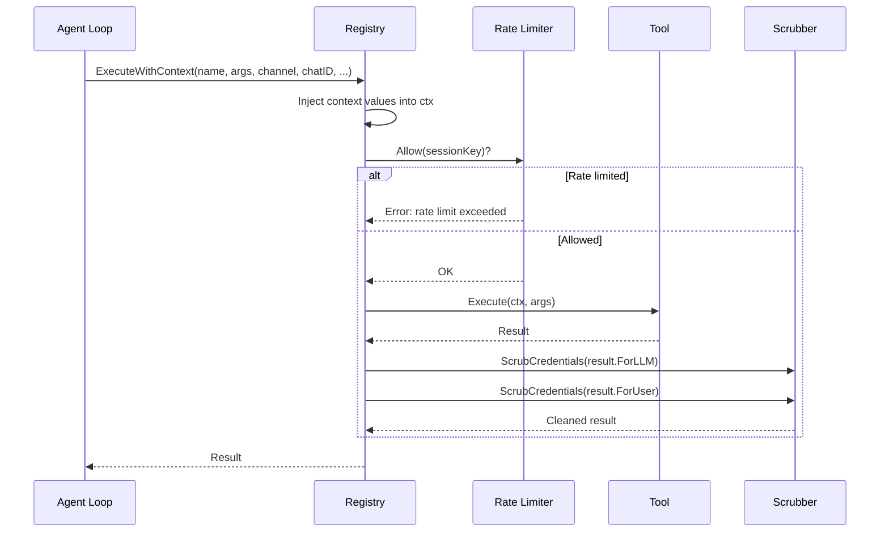
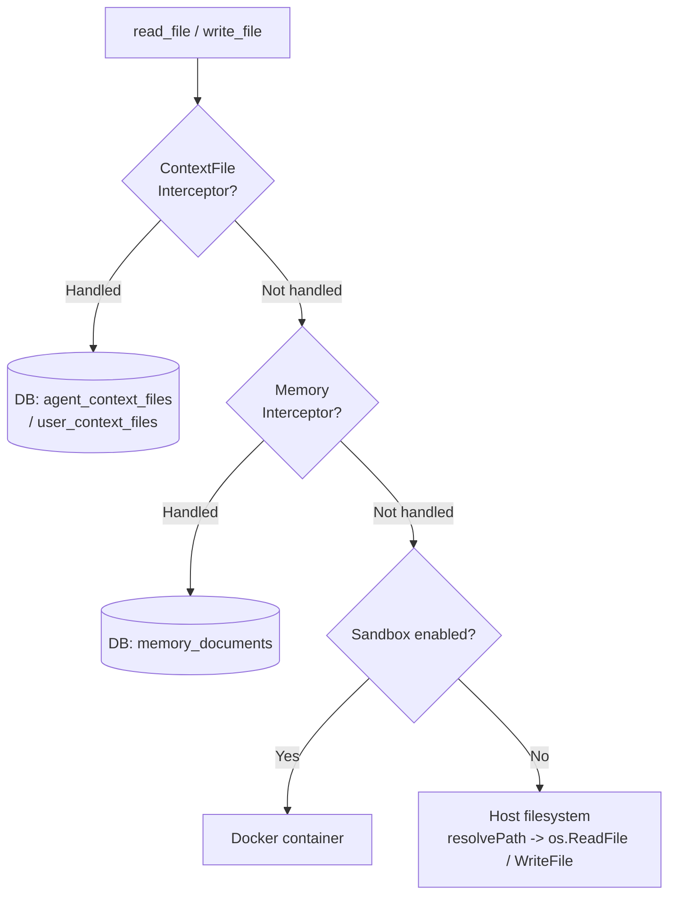
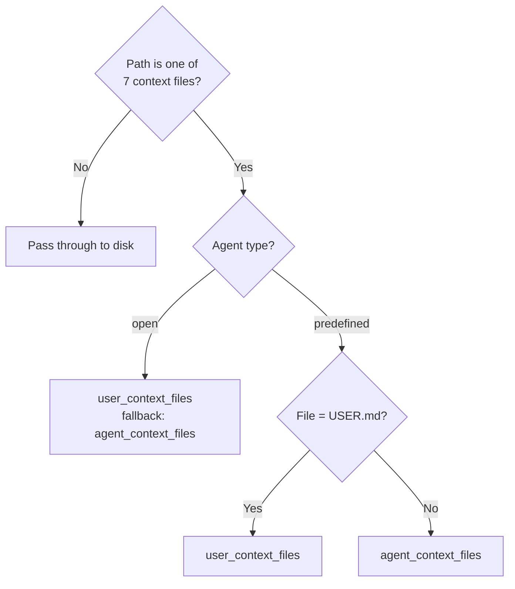
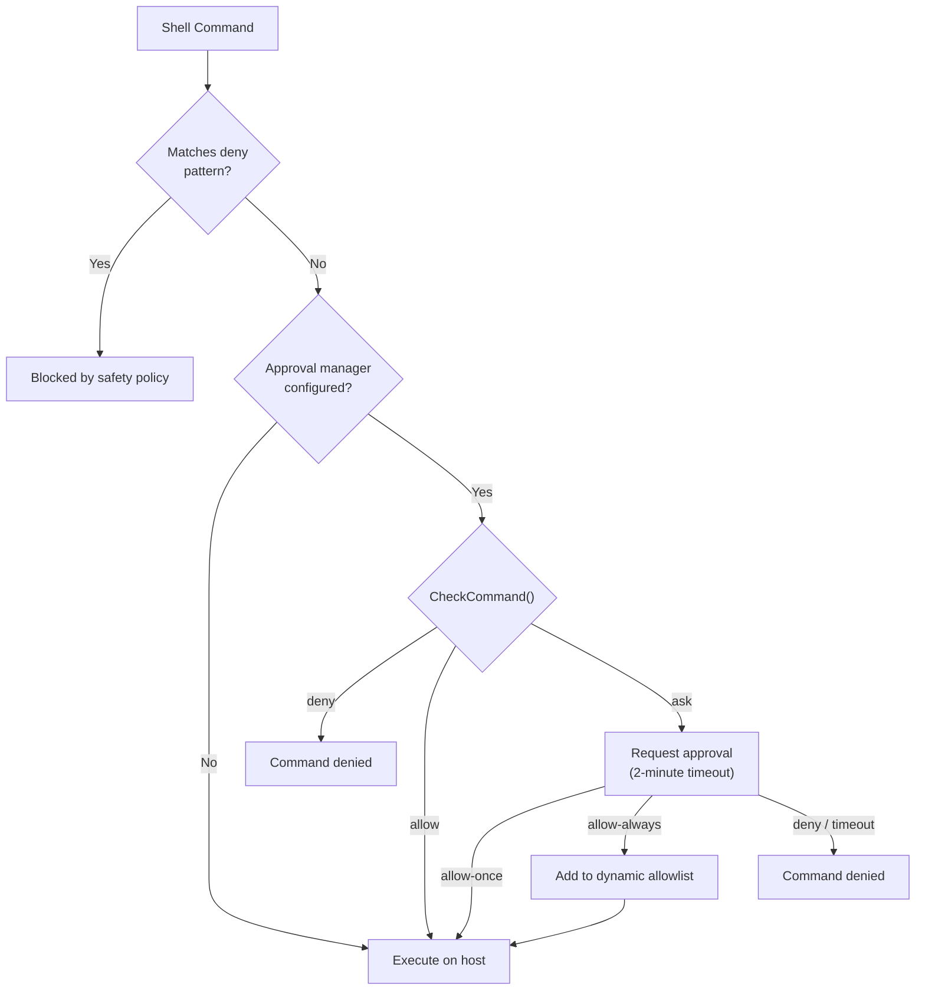
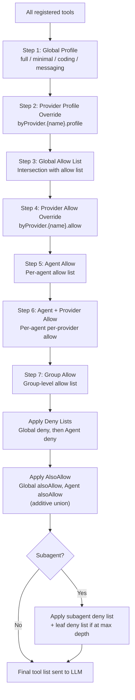
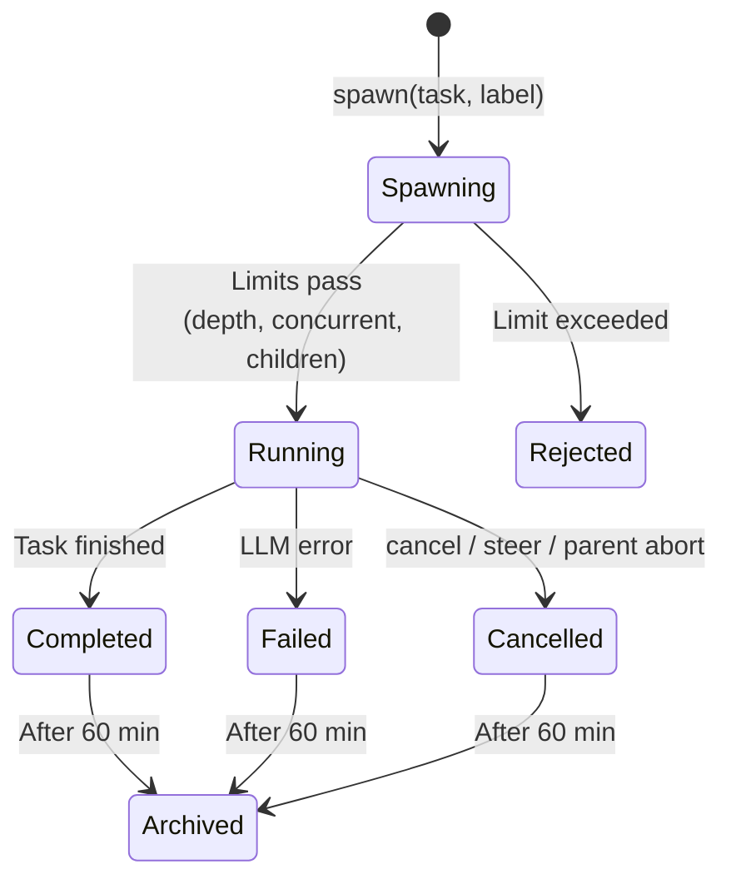
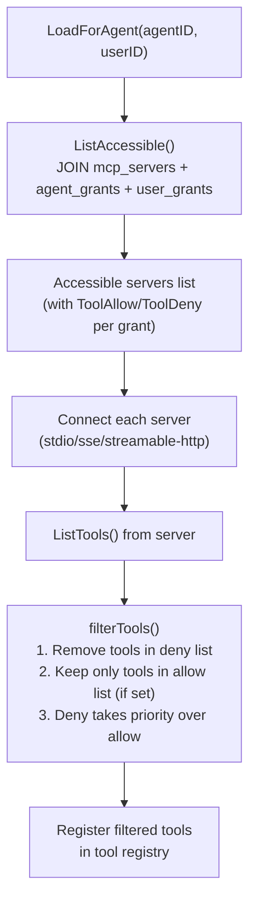
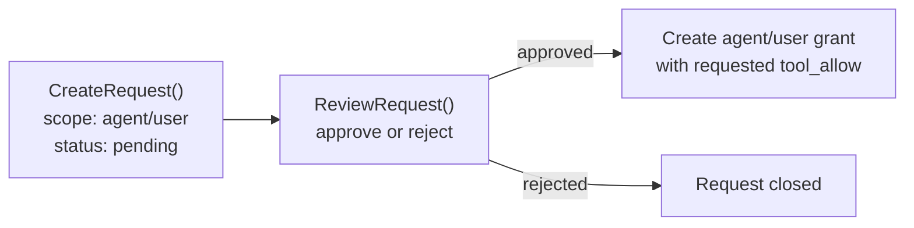
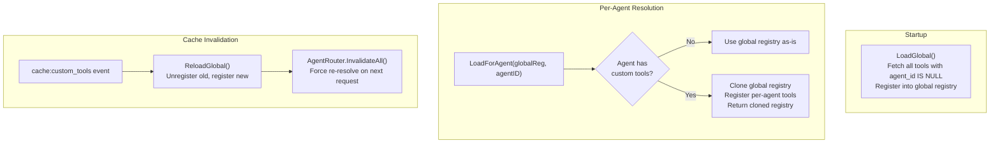

# 03 - Tools System

The tools system is the bridge between the agent loop and the external environment. When the LLM emits a tool call, the agent loop delegates execution to the tool registry, which handles rate limiting, credential scrubbing, policy enforcement, and virtual filesystem routing before returning results for the next LLM iteration.

---

## 1. Tool Execution Flow



ExecuteWithContext performs 8 steps:

1. Lock registry, find tool by name, unlock
2. Inject `WithToolChannel(ctx, channel)`
3. Inject `WithToolChatID(ctx, chatID)`
4. Inject `WithToolPeerKind(ctx, peerKind)`
5. Inject `WithToolSandboxKey(ctx, sessionKey)`
6. Rate limit check via `rateLimiter.Allow(sessionKey)`
7. Execute `tool.Execute(ctx, args)`
8. Scrub credentials from both `ForLLM` and `ForUser` output, log duration

Context keys ensure each tool call receives the correct per-call values without mutable fields, allowing tool instances to be shared safely across concurrent goroutines.

---

## 2. Complete Tool Inventory

### Filesystem (group: `fs`)

| Tool | Description |
|------|-------------|
| `read_file` | Read file contents with optional line range |
| `write_file` | Write or create a file |
| `edit_file` | Apply targeted edits to a file |
| `list_files` | List directory contents |
| `search` | Search file contents with regex |
| `glob` | Find files matching a glob pattern |

### Runtime (group: `runtime`)

| Tool | Description |
|------|-------------|
| `exec` | Execute a shell command |
| `process` | Manage running processes |

### Web (group: `web`)

| Tool | Description |
|------|-------------|
| `web_search` | Search the web |
| `web_fetch` | Fetch and parse a URL |

### Memory (group: `memory`)

| Tool | Description |
|------|-------------|
| `memory_search` | Search memory documents |
| `memory_get` | Retrieve a specific memory document |

### Sessions (group: `sessions`)

| Tool | Description |
|------|-------------|
| `sessions_list` | List active sessions |
| `sessions_history` | View session message history |
| `sessions_send` | Send a message to a session |
| `sessions_spawn` | Spawn an async subagent task |
| `subagents` | Manage subagent tasks (list, cancel, steer) |
| `session_status` | Get current session status |

### UI (group: `ui`)

| Tool | Description |
|------|-------------|
| `browser` | Browser automation via Rod + CDP |
| `canvas` | Visual canvas operations |

### Automation (group: `automation`)

| Tool | Description |
|------|-------------|
| `cron` | Manage scheduled tasks |
| `gateway` | Gateway administration commands |

### Messaging (group: `messaging`)

| Tool | Description |
|------|-------------|
| `message` | Send a message to a channel |

### Other Tools

| Tool | Description |
|------|-------------|
| `skill_search` | Search available skills (BM25) |
| `image` | Generate images |
| `tts` | Text-to-speech synthesis (OpenAI, ElevenLabs, Edge, MiniMax) |
| `spawn` | Spawn subagent (alternative to sessions_spawn) |
| `nodes` | Node graph operations |

### Global Skills

Global skills (Tier 4 in the skills hierarchy) provide extended capabilities via Python scripts. The agent invokes them using the `exec` tool.

**ai-multimodal**: Gemini-powered multimodal analysis and generation
- **Capabilities**: Image/video/audio analysis, OCR, transcription, image generation (Imagen 4), video generation (Veo)
- **Setup**: Set `GEMINI_API_KEY` env var; install Python deps: `pip install google-genai pillow python-dotenv`
- **Usage**: Agent runs CLI commands like `python ~/.goclaw/skills/ai-multimodal/scripts/gemini_batch_process.py --task analyze --files image.png`
- **Features**: Batch processing, media format detection, API key rotation support, multiple output formats

---

## 3. Filesystem Tools and Virtual FS Routing

In managed mode, filesystem operations are intercepted before hitting the host disk. Two interceptor layers route specific paths to the database instead.



### ContextFileInterceptor -- 7 Routed Files

| File | Description |
|------|-------------|
| `SOUL.md` | Agent personality and behavior |
| `IDENTITY.md` | Agent identity information |
| `AGENTS.md` | Sub-agent definitions |
| `TOOLS.md` | Tool usage guidance |
| `HEARTBEAT.md` | Periodic wake-up instructions |
| `USER.md` | Per-user preferences and context |
| `BOOTSTRAP.md` | First-run instructions (write empty = delete row) |

### Routing by Agent Type



- **Open agents**: All 7 files are per-user. If a user file does not exist, the agent-level template is returned as fallback.
- **Predefined agents**: Only `USER.md` is per-user. All other files come from the agent-level store.

### MemoryInterceptor

Routes `MEMORY.md`, `memory.md`, and `memory/*` paths. Per-user results take priority with a fallback to global scope. Writing a `.md` file automatically triggers `IndexDocument()` (chunking + embedding).

### Path Security

`resolvePath()` joins relative paths with the workspace root, applies `filepath.Clean()`, and verifies the result with `HasPrefix()`. This prevents path traversal attacks (e.g., `../../../etc/passwd`). The extended `resolvePathWithAllowed()` permits additional prefixes for skills directories.

---

## 4. Shell Execution

The `exec` tool allows the LLM to run shell commands, with multiple defense layers.

### Deny Patterns

| Category | Blocked Patterns |
|----------|------------------|
| Destructive file ops | `rm -rf`, `del /f`, `rmdir /s` |
| Disk destruction | `mkfs`, `dd if=`, `> /dev/sd*` |
| System control | `shutdown`, `reboot`, `poweroff` |
| Fork bombs | `:(){ ... };:` |
| Remote code exec | `curl \| sh`, `wget -O - \| sh` |
| Reverse shells | `/dev/tcp/`, `nc -e` |
| Eval injection | `eval $()`, `base64 -d \| sh` |

### Approval Workflow



### Sandbox Routing

When a sandbox manager is configured and a `sandboxKey` exists in context, commands execute inside a Docker container. The host working directory maps to `/workspace` in the container. Host timeout is 60 seconds; sandbox timeout is 300 seconds. If sandbox returns `ErrSandboxDisabled`, execution falls back to the host.

---

## 5. Policy Engine

The policy engine determines which tools the LLM can use through a 7-step allow pipeline followed by deny subtraction and additive alsoAllow.



### Profiles

| Profile | Tools Included |
|---------|---------------|
| `full` | All registered tools (no restriction) |
| `coding` | `group:fs`, `group:runtime`, `group:sessions`, `group:memory`, `image` |
| `messaging` | `group:messaging`, `sessions_list`, `sessions_history`, `sessions_send`, `session_status` |
| `minimal` | `session_status` only |

### Tool Groups

| Group | Members |
|-------|---------|
| `fs` | `read_file`, `write_file`, `list_files`, `edit_file`, `search`, `glob` |
| `runtime` | `exec`, `process` |
| `web` | `web_search`, `web_fetch` |
| `memory` | `memory_search`, `memory_get` |
| `sessions` | `sessions_list`, `sessions_history`, `sessions_send`, `sessions_spawn`, `subagents`, `session_status` |
| `ui` | `browser`, `canvas` |
| `automation` | `cron`, `gateway` |
| `messaging` | `message` |
| `goclaw` | All native tools (composite group) |

Groups can be referenced in allow/deny lists with the `group:` prefix (e.g., `group:fs`). The MCP manager dynamically registers `mcp` and `mcp:{serverName}` groups at runtime.

---

## 6. Subagent System

Subagents are child agent instances spawned to handle parallel or complex tasks. They run in background goroutines with restricted tool access.

### Lifecycle



### Limits

| Constraint | Default | Description |
|------------|---------|-------------|
| MaxConcurrent | 8 | Total running subagents across all parents |
| MaxSpawnDepth | 1 | Maximum nesting depth |
| MaxChildrenPerAgent | 5 | Maximum children per parent agent |
| ArchiveAfterMinutes | 60 | Auto-archive completed tasks |
| Max iterations | 20 | LLM loop iterations per subagent |

### Subagent Actions

| Action | Behavior |
|--------|----------|
| `spawn` (async) | Launch in goroutine, return immediately with acceptance message |
| `run` (sync) | Block until subagent completes, return result directly |
| `list` | List all subagent tasks with status |
| `cancel` | Cancel by specific ID, `"all"`, or `"last"` |
| `steer` | Cancel + settle 500ms + respawn with new message |

### Tool Deny Lists

| List | Denied Tools |
|------|-------------|
| Always denied (all depths) | `gateway`, `agents_list`, `whatsapp_login`, `session_status`, `cron`, `memory_search`, `memory_get`, `sessions_send` |
| Leaf denied (max depth) | `sessions_list`, `sessions_history`, `sessions_spawn`, `spawn`, `subagent` |

Results are announced back to the parent agent via the message bus, optionally batched through an AnnounceQueue with debouncing.

---

## 7. MCP Bridge Tools

GoClaw integrates with Model Context Protocol (MCP) servers via `internal/mcp/`. The MCP Manager connects to external tool servers and registers their tools in the tool registry with a configurable prefix.

### Transports

| Transport | Description |
|-----------|-------------|
| `stdio` | Launch process with command + args, communicate via stdin/stdout |
| `sse` | Connect to SSE endpoint via URL |
| `streamable-http` | Connect to HTTP streaming endpoint |

### Behavior

- Health checks run every 30 seconds per server
- Reconnection uses exponential backoff (2s initial, 60s max, 10 attempts)
- Tools are registered with a prefix (e.g., `mcp_servername_toolname`)
- Dynamic tool group registration: `mcp` and `mcp:{serverName}` groups

### Access Control (Managed Mode)

In managed mode, MCP server access is controlled through per-agent and per-user grants stored in PostgreSQL.



**Grant types**:

| Grant | Table | Scope | Fields |
|-------|-------|-------|--------|
| Agent grant | `mcp_agent_grants` | Per server + agent | `tool_allow`, `tool_deny` (JSONB arrays), `config_overrides`, `enabled` |
| User grant | `mcp_user_grants` | Per server + user | `tool_allow`, `tool_deny` (JSONB arrays), `enabled` |

**Access request workflow**: Users can request access to MCP servers. Admins review and approve or reject. On approval, a corresponding grant is created transactionally.



---

## 8. Custom Tools (Managed Mode)

Define shell-based tools at runtime via the HTTP API -- no recompile or restart needed. Custom tools are stored in the `custom_tools` PostgreSQL table and loaded dynamically into the agent's tool registry.

### Lifecycle



### Scope

| Scope | `agent_id` | Behavior |
|-------|-----------|----------|
| Global | `NULL` | Available to all agents |
| Per-agent | UUID | Available only to the specified agent |

### Command Execution

1. **Template rendering**: `{{.key}}` placeholders replaced with shell-escaped argument values (single-quote wrapping with embedded quote escaping)
2. **Deny pattern check**: Same deny patterns as the `exec` tool (blocks `curl|sh`, reverse shells, etc.)
3. **Execution**: `sh -c <rendered_command>` with configurable timeout (default 60s) and optional working directory
4. **Environment variables**: Stored encrypted (AES-256-GCM) in the database, decrypted at runtime and injected into the command environment

### JSON Config Example

```json
{
  "name": "dns_lookup",
  "description": "Look up DNS records for a domain",
  "parameters": {
    "type": "object",
    "properties": {
      "domain": { "type": "string", "description": "Domain name" },
      "record_type": { "type": "string", "enum": ["A", "AAAA", "MX", "CNAME", "TXT"] }
    },
    "required": ["domain"]
  },
  "command": "dig +short {{.record_type}} {{.domain}}",
  "timeout_seconds": 10,
  "enabled": true
}
```

---

## 8. Credential Scrubbing

Tool output is automatically scrubbed before being returned to the LLM. Enabled by default in the registry.

### Detected Patterns

| Type | Pattern |
|------|---------|
| OpenAI | `sk-[a-zA-Z0-9]{20,}` |
| Anthropic | `sk-ant-[a-zA-Z0-9-]{20,}` |
| GitHub PAT | `ghp_`, `gho_`, `ghu_`, `ghs_`, `ghr_` + 36 alphanumeric characters |
| AWS | `AKIA[A-Z0-9]{16}` |
| Generic | `(api_key\|token\|secret\|password\|bearer\|authorization)[:=]value` (case-insensitive) |

All matches are replaced with `[REDACTED]`.

---

## 9. Rate Limiter

The tool registry supports per-session rate limiting via `ToolRateLimiter`. When configured, each `ExecuteWithContext` call checks `rateLimiter.Allow(sessionKey)` before tool execution. Rate-limited calls receive an error result without executing the tool.

---

## File Reference

| File | Purpose |
|------|---------|
| `internal/tools/registry.go` | Registry: Register, Execute, ExecuteWithContext, ProviderDefs |
| `internal/tools/types.go` | Tool interface, ContextualTool, InterceptorAware, and other config interfaces |
| `internal/tools/policy.go` | PolicyEngine: 7-step pipeline, tool groups, profiles, subagent deny lists |
| `internal/tools/filesystem.go` | read_file, write_file, edit_file with interceptor support |
| `internal/tools/filesystem_list.go` | list_files tool |
| `internal/tools/filesystem_write.go` | Additional write operations |
| `internal/tools/shell.go` | ExecTool: deny patterns, approval workflow, sandbox routing |
| `internal/tools/scrub.go` | ScrubCredentials: credential pattern matching and redaction |
| `internal/tools/subagent.go` | SubagentManager: spawn, cancel, steer, run sync, deny lists |
| `internal/tools/context_file_interceptor.go` | ContextFileInterceptor: 7-file routing by agent type |
| `internal/tools/memory_interceptor.go` | MemoryInterceptor: MEMORY.md and memory/* routing |
| `internal/tools/skill_search.go` | Skill search tool (BM25) |
| `internal/tools/tts.go` | Text-to-speech tool (4 providers) |
| `internal/mcp/manager.go` | MCP Manager: server connections, health checks, tool registration |
| `internal/mcp/bridge_tool.go` | MCP bridge tool implementation |
| `internal/tools/dynamic_loader.go` | DynamicLoader: LoadGlobal, LoadForAgent, ReloadGlobal |
| `internal/tools/dynamic_tool.go` | DynamicTool: template rendering, shell escaping, execution |
| `internal/store/custom_tool_store.go` | CustomToolStore interface |
| `internal/store/pg/custom_tools.go` | PostgreSQL custom tools implementation |
| `internal/store/mcp_store.go` | MCPServerStore interface (grants, access requests) |
| `internal/store/pg/mcp_servers.go` | PostgreSQL MCP implementation |
